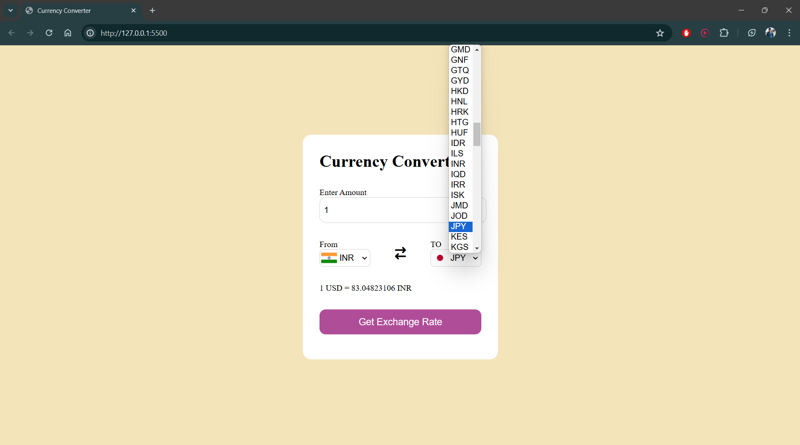

# currency-converter-JavaScript

This is a simple currency converter web application built using JavaScript, HTML, and CSS. It utilizes real-time exchange rates from an external API to perform currency conversions.

## Screenshots

1. **Screenshot of Currency Converter Interface**
   

2. **Currency Conversion Example**
   

3. **Currency Dropdown Selection**
   

4. **Currency Conversion Result**
   

## Description

The currency converter allows users to input an amount in one currency and select another currency to convert to. It fetches the latest exchange rates using an external API and displays the converted amount instantly.

## Features

- Real-time currency conversion
- User-friendly interface with dropdown menus for currency selection
- Automatically updates exchange rates on page load and when currencies are changed

## How to Use

1. Clone this repository to your local machine.
2. Open the `index.html` file in your web browser.
3. Enter the amount you want to convert.
4. Select the currencies you are converting from and to using the dropdown menus.
5. The converted amount will be displayed instantly.

## Technologies Used

- JavaScript
- HTML
- CSS

## Credits

This project was created by Sudhanshu Ranjan.

## License

This project is licensed under the [MIT License](LICENSE).
